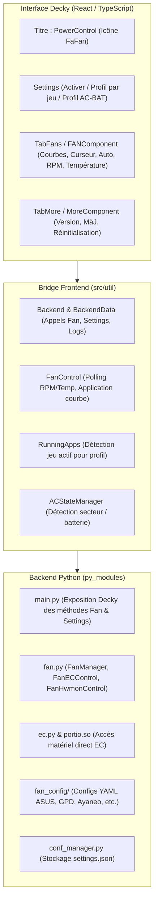

# Plan d'implémentation : Conservation exclusive du contrôle du ventilateur (Fan Control Only)

## Description de l'objectif
Transformer le plugin PowerControl pour qu'il conserve **exclusivement le système de contrôle du ventilateur (Fan Control)** en réécrivant **le moins de code possible**.
Toute la logique complexe de gestion des ventilateurs (courbes de ventilation personnalisées, vitesse manuelle, mode automatique, prise en charge EC et Hwmon pour Ayaneo, GPD, Asus, AOKZOE, OneXPlayer, MSI, Steam Deck, profils par jeu et par état secteur/batterie) reste **100% intacte**.
Les composants et dépendances superflus liés au CPU, GPU, TDP et limitation de charge de batterie sont purgés proprement pour alléger le plugin et éliminer les erreurs de build et d'exécution.



---

## User Review Required

> [!IMPORTANT]
> **Modifications UI & suppression des onglets CPU/GPU/Power :**
> - L'onglet par défaut devient immédiatement le contrôle du ventilateur (`TabFans`).
> - Seuls deux onglets sont conservés dans la navigation : **Ventilateur** (`FaFan`) et **Plus** (`FaLayerGroup` pour mise à jour, version et réinitialisation).
> - La vue liste (`ListView`) conserve les paramètres globaux (profils par jeu et par statut AC/batterie), le composant ventilateur, et l'onglet Plus.
> - Le patch QAM (`QAMPatch` pour TDP/GPU dans le menu SteamOS) est entièrement retiré, ce qui accélère le démarrage et évite les instabilités lors des mises à jour de SteamOS.

> [!NOTE]
> **Préservation des profils :**
> Le système de profils (par jeu et par statut secteur/batterie) est conservé pour les ventilateurs : vous pourrez toujours assigner une courbe spécifique à un jeu ou avoir un profil silencieux sur batterie.

---

## Open Questions

Aucune question bloquante identifiée à ce stade. La demande est claire : conserver uniquement le contrôle du ventilateur avec un minimum de modifications du code existant.

---

## Proposed Changes

### Backend Python (`py_modules/` et `main.py`)

L'intégralité du module [fan.py](file:///mnt/c/Users/LOGOSMAX/Desktop/PowerControl-FanOnly-/py_modules/fan.py), de [ec.py](file:///mnt/c/Users/LOGOSMAX/Desktop/PowerControl-FanOnly-/py_modules/ec.py), des configurations [fan_config/](file:///mnt/c/Users/LOGOSMAX/Desktop/PowerControl-FanOnly-/py_modules/fan_config), de [portio.so](file:///mnt/c/Users/LOGOSMAX/Desktop/PowerControl-FanOnly-/py_modules/portio.so) et de [conf_manager.py](file:///mnt/c/Users/LOGOSMAX/Desktop/PowerControl-FanOnly-/py_modules/conf_manager.py) est **conservée telle quelle sans modification de logique**.

#### [MODIFY] [main.py](file:///mnt/c/Users/LOGOSMAX/Desktop/PowerControl-FanOnly-/main.py)
- Retirer l'importation de `cpu.py` (`from cpu import cpuManager`).
- Supprimer les méthodes inutilisées liées au CPU/TDP : `is_intel`, `get_ryzenadj_info`, `get_rapl_info`, `receive_suspendEvent`.
- Conserver strictement les méthodes de ventilateur (`get_fanRPM`, `get_fanRPMPercent`, `get_fanTemp`, `get_fanIsAuto`, `get_fanConfigList`, `set_fanAuto`, `set_fanPercent`, `set_fanCurve`), de configuration (`get_settings`, `set_settings`), de langue, de version/mise à jour, et de logs.

#### [DELETE] `py_modules/cpu.py`
- Fichier CPUManager désormais inutile.

#### [DELETE] `py_modules/tt.sh`
- Script GPU Intel résiduel non utilisé.

#### [DELETE] `bin/ryzenadj`
- Binaire ryzenadj non nécessaire pour la ventilation.

#### [DELETE] `backend/sh_tools.sh`
- Script d'anciennes commandes CPU/GPU résiduelles.

---

### Frontend Utilities (`src/util/`)

#### [MODIFY] [src/util/backend.ts](file:///mnt/c/Users/LOGOSMAX/Desktop/PowerControl-FanOnly-/src/util/backend.ts)
- Élaguer les fonctions `callable` superflues (CPU, GPU, TDP, RAPL, SMT, Gouverneur, EPP).
- Simplifier `BackendData.initConfig` pour ne charger que `fanConfigs`, `currentVersion` et `latestVersion`.
- Réduire `Backend.applySettings()` pour n'appliquer que `Backend.handleFanControl()`.
- Réduire `Backend.resetSettings()` pour n'appeler que `Backend.resetFanSettings()`.
- Conserver intactes toutes les méthodes d'accès et de calcul des courbes de ventilateurs (`getFanRPM`, `getFanTemp`, `getFanConfigs`, `getFanPwmMode`, `getFanHwmonDefaultCurve`, `getDefaultFanSetting`, etc.).

#### [MODIFY] [src/util/pluginMain.ts](file:///mnt/c/Users/LOGOSMAX/Desktop/PowerControl-FanOnly-/src/util/pluginMain.ts)
- Retirer l'initialisation et le démontage de `QAMPatch`.
- Retirer l'écouteur `addEventListener("QAM_setTDP", ...)`.
- Conserver intacts `FanControl` (boucle de mise à jour des ventilateurs), `RunningApps` (changement de jeu actif) et `ACStateManager` (changement alimentation secteur/batterie).

#### [MODIFY] [src/util/settings.ts](file:///mnt/c/Users/LOGOSMAX/Desktop/PowerControl-FanOnly-/src/util/settings.ts)
- Remplacer l'onglet par défaut `currentTabRoute = "cpu"` par `currentTabRoute = "fans"`.
- Remplacer les valeurs initiales calculées par `Backend.data` dans `AppSetting` par des constantes statiques de repli, afin d'éviter tout appel backend CPU/GPU.
- Laisser intacte la structure des données `FanSetting`, `SettingsData`, `AppSettingData` et `fanProfileNameList` pour garantir la compatibilité ascendante des configurations déjà sauvegardées.

#### [MODIFY] [src/util/index.ts](file:///mnt/c/Users/LOGOSMAX/Desktop/PowerControl-FanOnly-/src/util/index.ts)
- Retirer l'export de `./patch`.

#### [DELETE] `src/util/patch.ts`
- Supprimer le code de patch des menus QAM TDP/GPU.

---

### Composants & Vues Frontend (`src/components/`, `src/tab/`, `src/index.tsx`)

#### [MODIFY] [src/index.tsx](file:///mnt/c/Users/LOGOSMAX/Desktop/PowerControl-FanOnly-/src/index.tsx)
- Supprimer les imports inutilisés (`TabCpu`, `TabGpu`, `TabPower`, `CPUComponent`, `GPUComponent`, `PowerComponent`, `BsCpuFill`, `PiGraphicsCardFill`, `PiLightningFill`).
- Remplacer l'icône principale par `<FaFan />`.
- Dans `TabView`, ne proposer que l'onglet **Ventilateur** (`TabFans`) et l'onglet **Plus** (`TabMore`), avec sélection par défaut sur `fans`.
- Dans `ListView`, afficher `SettingsComponent`, `FANComponent`, et `MoreComponent`.

#### [MODIFY] [src/components/settings.tsx](file:///mnt/c/Users/LOGOSMAX/Desktop/PowerControl-FanOnly-/src/components/settings.tsx)
- Supprimer le bouton modal `PowerInfoModel` dans `QuickAccessTitleView` et le composant `PowerInfoModel` (qui appelait les infos de puissance CPU/RAPL désormais absentes).

#### [MODIFY] [src/components/index.ts](file:///mnt/c/Users/LOGOSMAX/Desktop/PowerControl-FanOnly-/src/components/index.ts)
- Retirer les exports de `cpu`, `gpu`, `customTDP`, `power`.

#### [MODIFY] [src/tab/index.ts](file:///mnt/c/Users/LOGOSMAX/Desktop/PowerControl-FanOnly-/src/tab/index.ts)
- Retirer les exports de `tabCpu`, `tabGpu`, `tabPower`.

#### [DELETE] Fichiers composants et onglets obsolètes :
- `src/components/cpu.tsx`
- `src/components/gpu.tsx`
- `src/components/power.tsx`
- `src/components/customTDP.tsx`
- `src/tab/tabCpu.tsx`
- `src/tab/tabGpu.tsx`
- `src/tab/tabPower.tsx`
- `src/types/cpu.ts`

---

## Plan de vérification

### Tests automatisés & Compilation
1. **Compilation Frontend (Rollup & TypeScript)** :
   ```bash
   npx --yes pnpm run build
   ```
   *Succès attendu :* Sortie propre dans `dist/index.js`, 0 erreur TypeScript, bundle allégé sans avertissements de variables inutilisées.

2. **Validation syntaxique Python** :
   ```bash
   python3 -m py_compile main.py py_modules/*.py
   ```
   *Succès attendu :* Code Python valide sans erreur de syntaxe ni d'importation manquante.

### Vérification manuelle
1. Ouverture du panneau QuickAccess :
   - Vérifier que l'icône du plugin est un ventilateur (`FaFan`).
   - Vérifier que l'onglet ouvert par défaut est le contrôle du ventilateur.
   - Vérifier les informations : Vitesse (RPM), Température (°C), Mode Actuel (Auto / Fixe / Courbe).
2. Tester le réglage manuel :
   - Choisir une vitesse manuelle (ex: 60%) et vérifier la persistance.
3. Tester les courbes personnalisées :
   - Vérifier l'affichage du canvas interactif [fanCanvas.tsx](file:///mnt/c/Users/LOGOSMAX/Desktop/PowerControl-FanOnly-/src/components/fanCanvas.tsx).
   - Déplacer des points de consigne et enregistrer un profil.
4. Profils par jeu et secteur :
   - Vérifier que le basculement entre profils de jeu ou secteur/batterie applique bien la courbe correspondante.
